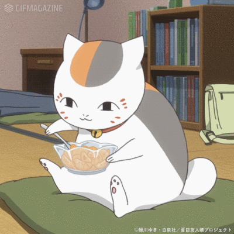

# Be Your Best Self：自律打卡器(❁´◡`❁)
#### 🏆每天进步一点点，做更好的自己；
#### 🏆养成好习惯，从每天打卡开始！

***

<br/>

## 🎈项目内容
### 简介：
如你所见，这个项目是**一个基于pygame实现的自律打卡器**，旨在让使用者通过该项目养成好习惯，成为更优秀的自己。
**使用方法**：开封即食，点击运行exe即可；初次使用必须注册新账号，账号可注册多个，账号信息保存在本地的`accounts`文件夹中。（小心不要误删）
### 功能：
- ✏️具备最基础的每日打卡功能，能够增删多项打卡内容，鼓励 **21天养成好习惯**。
- ✏️支持注册**多个打卡账号**，可供多名用户独立打卡。
- ✏️用户的每项打卡内容初始化有且仅有一次补签次数，漏签一天会自动补签，当漏签时**补签次数不足则打卡进度清零**，请用户务必按时打卡。
- 🔐用户的**密码使用SHA256算法**加密保存，一定程度上提高了安全性和可靠性。
- 🏆纪念馆模块**永久记录坚持打卡21天的好习惯**，可温故而知新，回望来路路漫漫，自豪感油然而生。
- 🎵音效模块支持**自定义背景音乐**。（选中本地音乐路径之后，如果路径更改，则会恢复默认背景音乐）
- 📒鸡汤模块支持**自定义鸡汤文字**（有一定的字数限制），用户可根据自身情况输入为自己量身定制有奇效的鸡汤。
- 😎头像模块支持**更换头像**（技术原因暂不支持上传自定义头像），项目提供了十种不同的头像进行更换。
### 结构：
```
BeYourBestSelf
├─ accounts   (账号信息存档)
├─ BeYourBestSelf.exe   (可执行文件)
├─ BeYourBestSelf.py   (项目源码)
├─ BeYourBestSelf_test.py   (测试用)
├─ fonts   (项目用到的字体)
├─ images   (项目用到的图片)
│  ├─ md
│  │  └─ nyankosensei.gif
│  ├─ nums
│  ├─ profiles
├─ music   (项目用到的音效)
│  ├─ allfinish.wav
│  ├─ click.mp3
├─ README.md
├─ requirements.txt   (环境配置)
└─ st   (完成打卡后的随机鸡汤)
   └─ sts.txt

```

<br/>

## 🎈运行环境
### 发布版：
- 64位windows系统应该都能跑吧（
### 源码：<p id="here"></p>
- ~~具体版本范围我也不是很了解~~ 
- 这里仅提供我自己的环境做参考：（详见requirements.txt）
  - python==1.13.1
  - easygui==0.98.3
  - pygame==2.6.1
  - pyinstaller==6.12.0（用于打包发布的）
- 源码环境配置instruction：（二选一即可）
```plain
pip install pygame easygui
```
```plain
pip install -r requirements.txt（请在项目根目录运行cmd）
```

<br/>

## 🎈该项目使用素材版权未授权说明
***声明：以下素材下载仅供学习交流使用，如侵权请联系qq:3349249326删除。***
#### 1. 字体：
- 所有字体皆从该网站下载：来自 [艺字网](https://www.yishuzi.cn/)

#### 2. 图像：（ps加工过）
- 开始页面背景图片：源自网络来源不可考
- 设置等ui：来自 [昵图网ID：27952562 NO：20190409115010617085](https://www.nipic.com/show/23575278.html)
- 笔记本图片：来自 [新图网](https://ixintu.com/)
- 数字图片：来自 [Veer图库](www.veer.com)
- 纪念馆组件中附图：[兜兜转转终于在lofter上找到原图了](https://t28563999.lofter.com/post/1cf39d8c_74cc08d)
- 执行文件的ico：来自 [Free Icons](https://icon-icons.com/zh/)

#### 3. 音乐：
- 背景音乐：灰澈-星茶会.flac（酷狗下载）
- 鼠标音效：即Minecraft点击音效，[下载网址](https://www.aigei.com)
- 清单任务完成/全部完成、删除任务项音效：Minecraft音效

<br/>

## 🎈更新日志
### v1.0.0
- 实现了最基础的自律打卡器内容

<br/>

## 🎈最后的最后
> 一些碎碎念：<br/>
> 敲这个项目的时间有点分散了，大致的实现思路和项目框架是在2024年的12月初花了三四天完成的，之后被迫专注于大学第一次期末考，但是放了寒假又有点懒得重温完善代码...一直拖到新学期开始3月初才又捡起这一坨接着码（逃<br/>
> ~~其实最初的实现思路还包括了家长协同管理、加入货币和商店正反馈激励系统等等，因为种种原因最后取消了。~~<br/>
> 这个项目是作为参加校赛的作品来准备的，本来想从以前写的杂七杂八的小项目里拿一份出来改改交上去，结果左看右看不满意，到最后几乎是从头写了这个项目（）<br/>
> 以及，在完成这个项目的过程中其实收获了很多，第一次试着写了md文件，第一次试着学了git，第一次试着用repo托管自己的代码...<br/>
> 尽管努力地去完善了，但是无论如何这个项目还很稚嫩，存在很多的不足，欢迎学习和交流ψ(｀∇´)ψ
> ###### *心之所向，素履以往。*
> ###### *路漫漫其修远兮，吾将上下而求索。*

<br/>

***
<!--  -->
#### 🌱成为优秀的自己，从一个好习惯开始 ~ 頑張りましょう!🌱

